<div align="center">

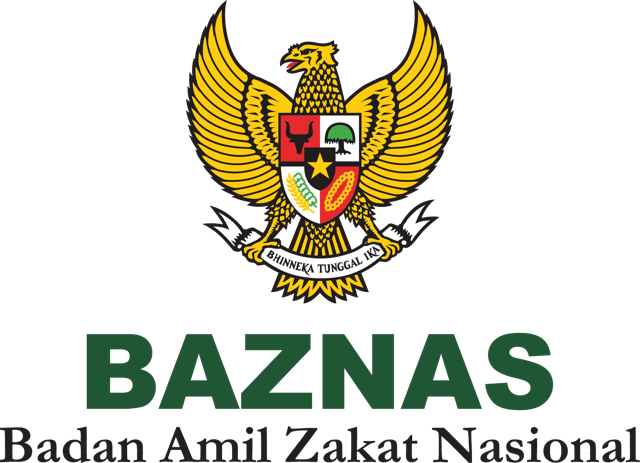

# Redesain UI/UX Website BAZNAS

**Membuat bayar zakat lebih mudah, informasi lebih mudah ditemukan, dan dana umat lebih transparan.**

Prototipe high-fidelity redesain [baznas.go.id](https://baznas.go.id) — Tugas Interaksi Manusia dan Komputer (IMK)
Kelompok 11 · Kelas 3SI2 · Politeknik Statistika STIS · 2025/2026


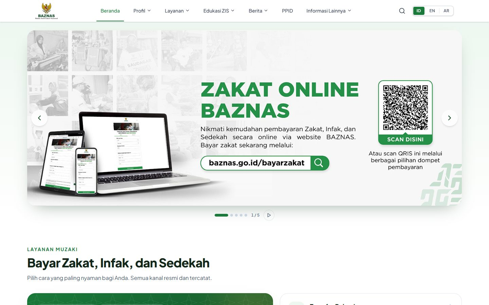

</div>

---

## Daftar Isi

- [Tentang Proyek](#tentang-proyek)
- [Masalah → Solusi](#masalah--solusi)
- [Galeri Fitur](#galeri-fitur)
- [Pencarian & Navigasi](#pencarian--navigasi)
- [Prinsip IMK yang Diterapkan](#prinsip-imk-yang-diterapkan)
- [Peta Halaman](#peta-halaman)
- [Menjalankan Proyek](#menjalankan-proyek)
- [Struktur Folder](#struktur-folder)
- [Tiga Bahasa (ID · EN · AR)](#tiga-bahasa-id--en--ar)
- [Catatan Data](#catatan-data)
- [Tim](#tim)

---

## Tentang Proyek

Website BAZNAS dipakai jutaan orang dengan tingkat literasi digital yang beragam, dari karyawan muda yang ingin membayar zakat penghasilan dengan cepat sampai donatur lansia yang ingin memastikan dananya tersalurkan. Observasi kami menemukan menu yang terlalu dalam, istilah yang membingungkan, formulir tanpa umpan balik, dan laporan keuangan yang hanya berupa berkas PDF.

Proyek ini merancang ulang website tersebut dengan **Lean UX** (Pertemuan 4), dievaluasi dengan **QUIS** (Pertemuan 5). Setiap perubahan diturunkan dari analisis kelompok tentang:

| Pertemuan | Topik analisis | Contoh penerapan di website |
|:--:|---|---|
| 6 | Manipulasi langsung | Pemisah ribuan otomatis, tombol Reset yang bisa diurungkan, peta interaktif, chip bahasa |
| 7 | Navigasi | Menu maksimal 2 level, breadcrumb, label yang lebih umum, pencarian global |
| 8 | Antarmuka ekspresif & desain emosional | Hasil kalkulator langsung tampil, doa setelah membayar, ayat & nuansa islami |
| 9 | Advancing UX | Indikator tahapan pembayaran, dasbor visual laporan keuangan, teks rata kiri |

> Pemetaan lengkap setiap komponen ke temuan dan hipotesis (H1–H5) ada di **[REDESIGN.md](REDESIGN.md)**.

---

## Masalah → Solusi

| Di website asli | Di hasil redesain |
|---|---|
| 11 menu dalam hamburger, kedalaman hingga 3 level | Menu horizontal, **maksimal 2 level**, dengan breadcrumb di setiap halaman |
| Kalkulator Zakat tersembunyi di menu Layanan | Kalkulator ada di menu **Edukasi ZIS** dan bisa dicari dari mana saja |
| Nominal diketik tanpa pemisah ribuan, tanpa tombol reset | **20000000 → 20.000.000** otomatis, tombol **Reset** yang bisa diurungkan |
| Tidak jelas sudah sampai tahap mana saat membayar | **Indikator 4 tahap** + status transaksi sampai Bukti Setor Zakat terkirim |
| Laporan keuangan hanya daftar PDF dengan ikon "mata" | **Dasbor grafik** + tampilan tabel, ikon folder/unduh, filter tahun |
| Peta jaringan berupa gambar statis | **Peta interaktif**: bisa di-zoom, digeser, dan titiknya diklik |
| Pemilih bahasa berupa dropdown tersembunyi | Chip **ID · EN · AR** yang selalu terlihat. Seluruh isi situs diterjemahkan, dan bahasa Arab tampil kanan-ke-kiri |
| Tidak ada pencarian situs | **Pencarian global** dengan saran otomatis, filter kategori, dan pengurutan |

---

## Galeri Fitur

<table>
  <tr>
    <td width="50%">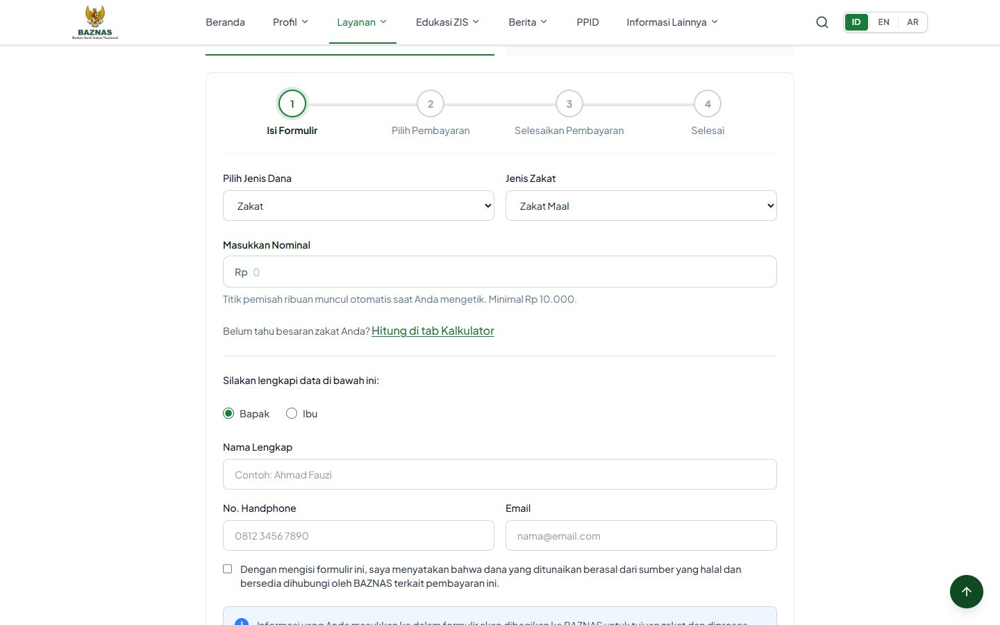<br /><b>Formulir Bayar ZIS</b> — indikator tahapan, nominal berformat otomatis, validasi langsung.</td>
    <td width="50%">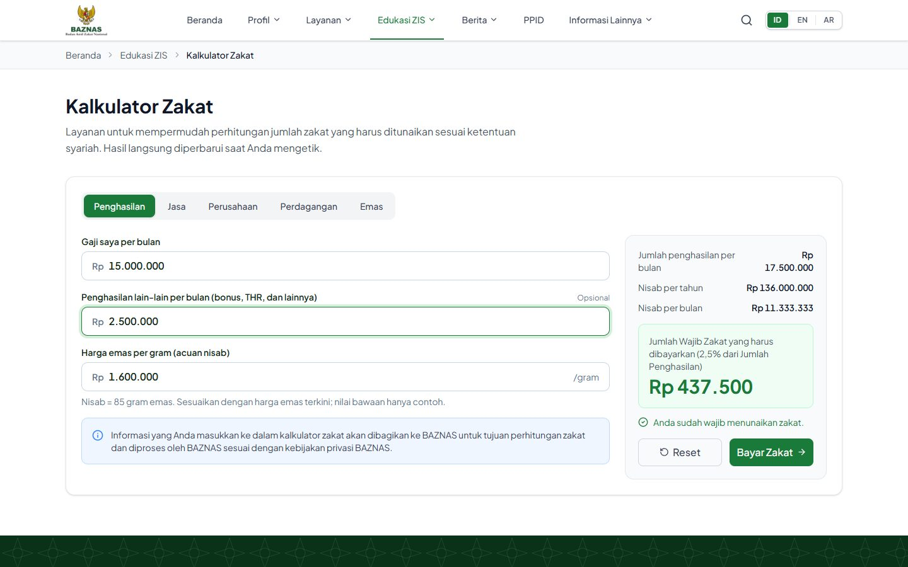<br /><b>Kalkulator Zakat</b> — 5 jenis zakat, hasil langsung tanpa tombol "Hitung", cek nisab otomatis.</td>
  </tr>
  <tr>
    <td>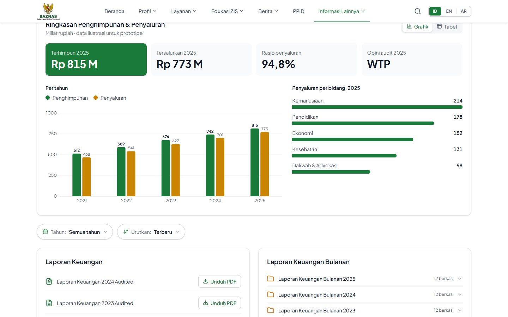<br /><b>Laporan Keuangan</b> — grafik penghimpunan & penyaluran, tampilan tabel, filter tahun.</td>
    <td>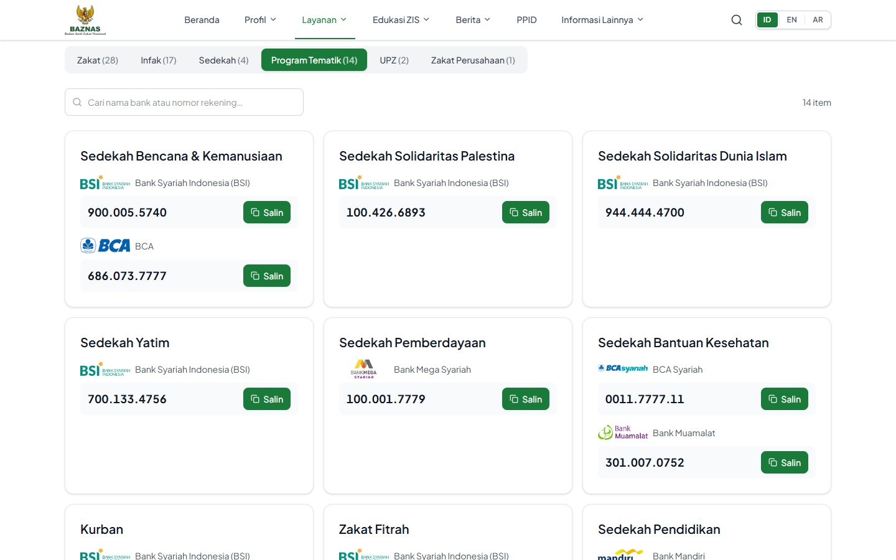<br /><b>Rekening Zakat</b> — 66 rekening resmi dalam 6 kategori, bisa dicari, salin satu klik.</td>
  </tr>
  <tr>
    <td>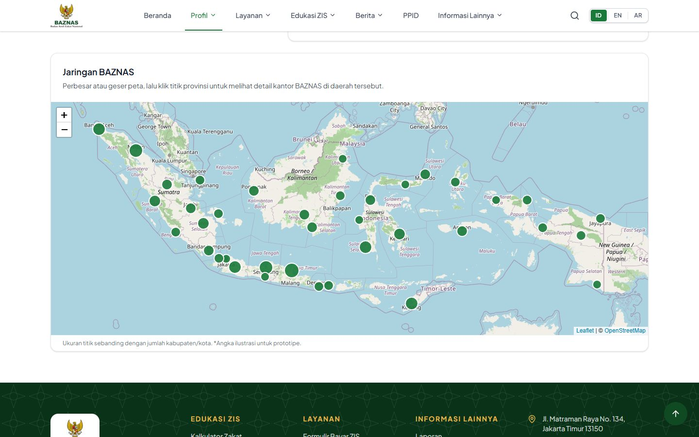<br /><b>Jaringan BAZNAS</b> — peta interaktif 38 provinsi menggantikan gambar statis.</td>
    <td>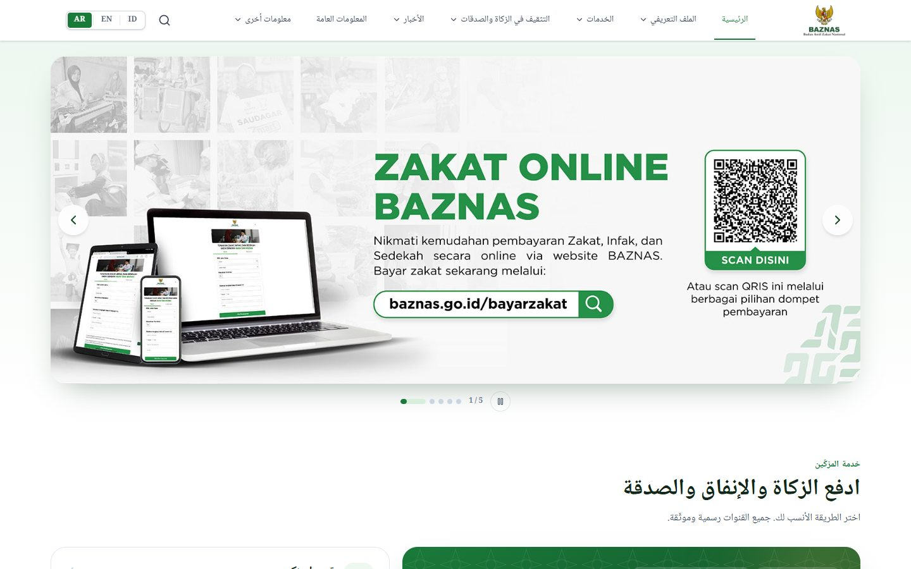<br /><b>Bahasa Arab (RTL)</b> — seluruh situs berganti arah dan bahasa dengan satu klik.</td>
  </tr>
</table>

<p align="center">
  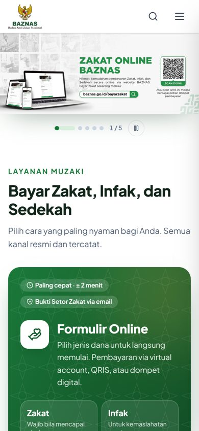<br />
  <sub>Responsif: menu hamburger dan tata letak bertumpuk di layar ponsel.</sub>
</p>

---

## Pencarian & Navigasi

Supaya pengguna tidak perlu menebak letak informasi, website kini punya beberapa cara untuk menemukan apa pun.

<table>
  <tr>
    <td width="50%">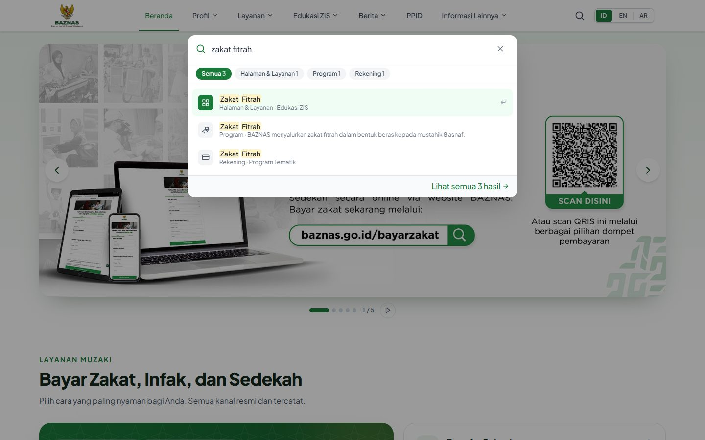</td>
    <td width="50%">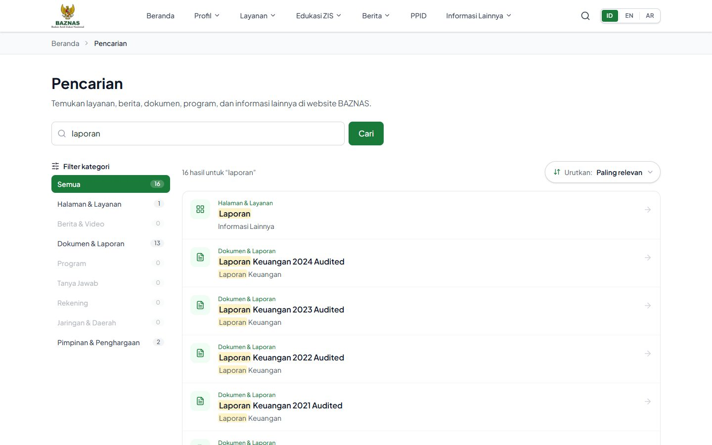</td>
  </tr>
</table>

| Fitur | Keterangan |
|---|---|
| 🔎 **Pencarian global** | Tombol cari di navbar, atau tekan <kbd>Ctrl</kbd>+<kbd>K</kbd> / <kbd>/</kbd> dari halaman mana pun |
| 💡 **Saran otomatis (autocomplete)** | Hasil muncul saat mengetik. Kata yang cocok disorot. Navigasi dengan <kbd>↑</kbd> <kbd>↓</kbd> <kbd>Enter</kbd> |
| 🗂️ **Pencarian per kategori** | Halaman & Layanan · Berita & Video · Dokumen & Laporan · Program · Tanya Jawab · Rekening · Jaringan & Daerah · Pimpinan & Penghargaan |
| 🎚️ **Filter** | Jumlah hasil per kategori, filter tahun (Laporan, Pustaka, Penghargaan), jenis lembaga, tingkat daerah |
| ↕️ **Pengurutan** | Paling relevan · Terbaru · Terlama · Judul A–Z · Judul Z–A |
| 🕘 **Riwayat & populer** | Pencarian terakhir tersimpan di perangkat. Tersedia juga saran pencarian populer |
| 🔗 **Tautan langsung** | Semua filter tersimpan di alamat, misalnya `/cari?q=laporan&urut=terbaru` atau `/layanan/rekening?kategori=tematik` |
| 🧭 **Navigasi** | Menu 2 level, breadcrumb, footer lengkap, tombol kembali ke atas, halaman 404 yang membantu |

Pencarian bekerja di **ketiga bahasa**: mengetik "زكاة" atau "zakat" sama-sama menemukan hasil.

---

## Prinsip IMK yang Diterapkan

- **Visibilitas status sistem:** menu aktif ditandai, breadcrumb, indikator tahapan pembayaran, notifikasi setiap aksi.
- **Kontrol & kebebasan pengguna:** Reset yang bisa diurungkan, kembali ke langkah sebelumnya, carousel bisa dijeda.
- **Pencegahan kesalahan:** validasi langsung dengan contoh format, nominal minimum, pemisah ribuan otomatis.
- **Konsistensi:** semua halaman memakai kerangka yang sama (navbar → breadcrumb → judul → kartu), warna, dan ukuran input.
- **Efisiensi:** pintasan keyboard, pencarian global, tautan langsung ke hasil terfilter.
- **Aksesibilitas:** tautan "Lewati ke konten", fokus keyboard terlihat, atribut ARIA, dukungan *reduced motion*, tabel alternatif untuk grafik, palet grafik aman bagi buta warna.
- **Desain emosional:** hijau dan emas bernuansa islami, ayat QS. At-Taubah 103, doa untuk muzaki setelah membayar.

---

## Peta Halaman

```
Beranda
├── Profil ............ Visi & Misi (+ peta jaringan) · Struktur BAZNAS · Profil Program · Penghargaan · Mitra
├── Layanan ........... Formulir Bayar ZIS · Rekening Zakat · Kantor Pusat BAZNAS · Register Penerima Zakat
│                       · Register Relawan · Register Label Taat Zakat
├── Edukasi ZIS ....... Kalkulator Zakat · Zakat Fitrah · Zakat Mal · Infak · Sedekah · Fidyah
├── Berita ............ Berita Program · Siaran Pers · Artikel · Baznas TV · Newsletter
├── PPID
├── Informasi Lainnya . Laporan · Panduan Brand · Pustaka · Website Baznas Daerah · Jaringan Lembaga
└── (footer) .......... FAQ · Konfirmasi Zakat · Kontak · Kebijakan Privasi · Pencarian (/cari)
```

---

## Menjalankan Proyek

Kebutuhan: **Node.js 18+**.

```bash
npm install      # pasang dependensi
npm run dev      # jalankan di http://localhost:5173
npm run build    # build produksi ke folder dist/
```

Tips:
- Pilih bahasa lewat alamat, misalnya `http://localhost:5173/?lang=ar`.
- Tekan <kbd>Ctrl</kbd>+<kbd>K</kbd> untuk mencoba pencarian.

---

## Struktur Folder

```
src/
├── app/
│   ├── components/     Navbar, Footer, PageHeader, SearchDialog, ListControls, ZakatCalculator, Stepper, …
│   ├── pages/          Halaman: FormulirBayarZIS, KalkulatorZakat, LaporanKeuangan, SearchPage, ProfilPages, …
│   ├── data/           Isi situs: navigation, content, pages (profil/berita/informasi), rekening
│   ├── lib/
│   │   ├── i18n.tsx    Sistem tiga bahasa (t, tx, tanggal, arah RTL)
│   │   ├── locales/    Kamus en.ts dan ar.ts
│   │   ├── search.ts   Indeks & pemeringkatan pencarian
│   │   └── format.ts   Format rupiah & pemisah ribuan
│   └── routes.tsx      Daftar rute
├── imports/            Logo & banner
└── styles/             Token desain (warna brand, font, pola islami)
docs/screenshots/       Gambar untuk README
REDESIGN.md             Matriks keterlacakan redesain → materi pertemuan & hipotesis
```

---

## Tiga Bahasa (ID · EN · AR)

Semua teks antarmuka tersedia dalam Bahasa Indonesia, English, dan العربية. Mode Arab otomatis kanan-ke-kiri.

Menambah teks baru:

1. Tulis teks Bahasa Indonesia di komponen dengan `t("Teks baru")` (atau `tx("Teks baru")` di file data).
2. Tambahkan terjemahannya di `src/app/lib/locales/en.ts` dan `ar.ts` dengan kunci yang sama.
3. Saat `npm run dev`, teks yang belum diterjemahkan tercatat di atribut `data-i18n-missing` pada elemen `<html>`.

---

## Catatan Data

| Data | Sumber |
|---|---|
| Rekening, struktur pimpinan, program, penghargaan, berita, video, pustaka, jaringan lembaga, kontak, kebijakan privasi | Disalin dari **baznas.go.id** (diakses 27 September 2026) |
| Angka keuangan, statistik beranda, jumlah kab/kota di peta, nomor VA, tarif fitrah/fidyah/kurban | **Ilustrasi** untuk prototipe (diberi label di halaman) |
| Formulir pendaftaran & pembayaran | **Simulasi**, tidak ada data yang dikirim ke server |

Ini adalah prototipe akademik, **bukan** situs resmi BAZNAS. Untuk bertransaksi, gunakan [baznas.go.id](https://baznas.go.id).

---

## Tim

**Kelompok 11 — Kelas 3SI2, Program Studi D-IV Komputasi Statistik, Politeknik Statistika STIS**

| Nama | NIM |
|---|---|
| Ananda Mizan Ali | 222312970 |
| Fakhri Iqbar | 222313076 |
| Zakia Faza Adila | 222313443 |

Mata kuliah Interaksi Manusia dan Komputer · Tahun Akademik 2025/2026

<div align="center"><sub>Dibuat dengan 💚 untuk kemudahan menunaikan zakat.</sub></div>
